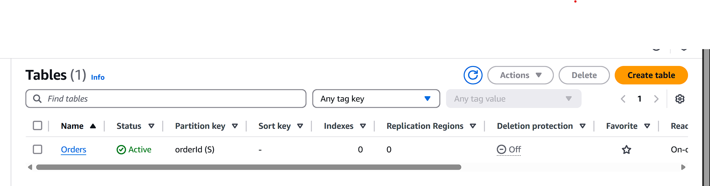

# cloud assingment to setup instructions

## Overreview of the assignment
-This project implements a simplified backend system for an e-commerce platform using AWS services in an event-driven architecture. When a new order is placed, it is processed through a system of notifications, queues, and serverless functions, and is reliably stored in a NoSQL database.
## First setting up dynamoDB
- using amazon cli navigate to DynamoDB
- c reate table 
- name the table Orders
- and set partion key = orderId

  ## second setup the Queue
  - navigate to sqs
  - first create a queue and name DLQ QUEUE this will be used to clear the primary queue
  - then I created a second Queue named OrderQueue using standerd settings and a visiability timout of 30 seconds
  - add the DLQ queue to the OrderQueue
.

